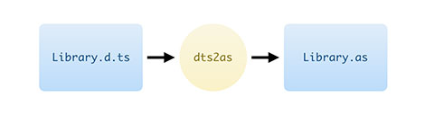
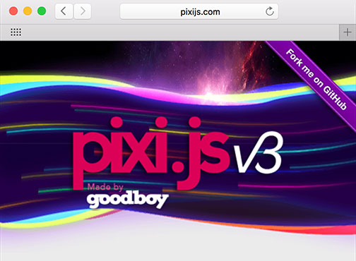
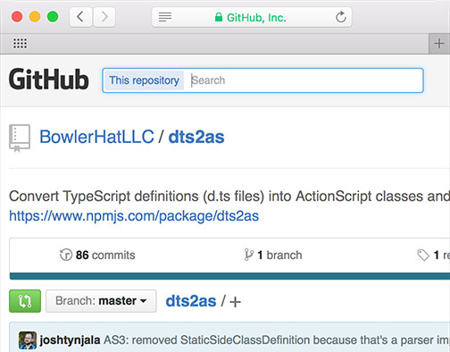
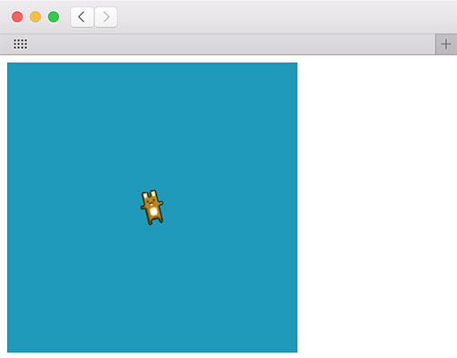

<div class="title-content">

# Introduction to `dts2as`: Using TypeScript definitions with ActionScript
A tutorial written by [Josh Tynjala](https://patreon.com/josht)

</div>

With Apache FlexJS™, you can [write code in ActionScript and transpile it to JavaScript](../hello-world-transpile-actionscript-apache-flexjs/index.md). Your ActionScript code can access web browser APIs, including full access to the HTML DOM. It's even possible to work with third-party JavaScript libraries using ActionScript &mdash; with full compile-time type checking.

The TypeScript community has collected type information for thousands of JavaScript libraries already, and ActionScript developers can benefit from their hard work too. The popular <a href="https://github.com/DefinitelyTyped/DefinitelyTyped">DefinitelyTyped</a> repository on Github contains TypeScript definitions for thousands of JavaScript libraries.

 dts2as => Library.as">

Let's say that you want to work with [**Pixi.js**](http://www.pixijs.com/). With many similarities to the display list from Adobe Flash Player, Pixi.js is an obvious JavaScript library to use with ActionScript.

<a href="http://www.pixijs.com/"></a>

Using the [`dts2as` command line utility](https://github.com/BowlerHatLLC/dts2as), we can generate a SWC file from the [Pixi.js TypeScript definitions](https://github.com/DefinitelyTyped/DefinitelyTyped/blob/master/pixi.js/pixi.js.d.ts). Then, we'll see how to build a simple app with this new SWC and Apache FlexJS.

## Requirements

For this tutorial, you should install **Apache FlexJS 0.7 or newer**. It may be downloaded with the [Apache Flex SDK Installer](http://flex.apache.org/installer.html).

Additionally, the `dts2as` command line utility requires [**Node.js**](http://nodejs.org/). You'll learn how to install `dts2as` in a moment.

## Getting started

Start by creating a new directory for your project. You might call it `HelloPixi`.

```
mkdir HelloPixi
cd HelloPixi
```

Download [`pixi.js.d.ts`](https://github.com/DefinitelyTyped/DefinitelyTyped/blob/master/pixi.js/pixi.js.d.ts) from DefinitelyTyped on Github (click the "Raw" button), and save it in the `HelloPixi` directory.

Next, install the `dts2as` command line utility.



It is available from Node Package Manager, and it should take just a few moments to download.

```
npm install -g dts2as
```

`dts2as` will be automatically added to your system path, so you can run it from anywhere.

## Create the SWC

When you run `dts2as`, it converts the TypeScript definitions into ActionScript code. Then, it runs the Apache FlexJS compiler to automatically create a SWC file.

```
dts2as --flexHome /path/to/flexjs --outSWC pixijs.swc pixi.js.d.ts
```

First, you must tell `dts2as` where Apache FlexJS is located. However, you may omit the `--flexHome` option if the `FLEX_HOME` environment variable already points to Apache FlexJS on your system.

Then, tell `dts2as` where to save the SWC file. Let's call it `pixijs.swc`. Finally, pass in one or more TypeScript definitions. In this case, you should pass in the `pixi.js.d.ts` file that you downloaded a moment ago.

Run the command, and in a few seconds, `dts2as` will create `pixijs.swc`. Let's try using Pixi.js in a simple ActionScript project.

## Your first project with `pixijs.swc`

Inside the `HelloPixi` directory, create a new `src` directory:

```
mkdir src
```

Then, create a file named `HelloPixi.as` in the `src` directory: 

``` actionscript
package
{
	import PIXI.Container;
	import PIXI.Sprite;
	import PIXI.Texture;
	import PIXI.autoDetectRenderer;

	public class HelloPixi
	{
		public function HelloPixi()
		{
			renderer = autoDetectRenderer(320, 320, {backgroundColor : 0x1099bb});
			document.body.appendChild(renderer.view);

			// create the root of the scene graph
			stage = new Container();

			// create a texture from an image path
			var texture:Texture = Texture.fromImage("images/bunny.png");

			// create a new Sprite using the texture
			bunny = new Sprite(texture);

			// center the sprite's anchor point
			bunny.anchor.x = 0.5;
			bunny.anchor.y = 0.5;

			// move the sprite to the center of the screen
			bunny.position.x = 160;
			bunny.position.y = 160;

			stage.addChild(bunny);

			// start animating
			animate();
		}
		
		private var renderer:Object;
		private var stage:Container;
		private var bunny:Sprite;
		
		private function animate():void
		{
			requestAnimationFrame(animate);

			// just for fun, let's rotate mr rabbit a little
			bunny.rotation += 0.1;

			// render the container
			renderer.render(stage);
		}
		
	}
}
```

## Create the HTML template

Create a file named `template.html` in the `HelloPixi` directory. Include the following markup:

``` html
<!doctype html>
<html>
	<head>
		<meta charset="utf-8"/>
		<title>Hello Pixi</title>
		<script src="https://cdnjs.cloudflare.com/ajax/libs/pixi.js/3.0.8/pixi.min.js"></script>
${head}
	</head>
	<body>
${body}
	</body>
</html>
```

Notice how we've added an extra `<script>` tag to load the Pixi.js library from the web. Obviously, you can use a local copy of Pixi.js, if you prefer.

## Compile the application on the command line

Just like we did in the [Hello World example](../hello-world-transpile-actionscript-apache-flexjs/index.md), we'll use `asjsc` to compile our project. This time, we'll reference `pixijs.swc` as an *external* library:

```
asjsc -external-library-path+=pixijs.swc -html-template=template.html src/HelloPixi.as
```

The `-external-library-path` option tells the compiler that the classes in our SWC exist, but that it shouldn't include them in the final output because the real code for the library will be loaded by the `<script>` tag in our HTML.

## Run the application

Open up `bin/js-release/index.html` in a web browser. You should see something like this:

<a href="demo/"></a>

<p class="text-center"><a href="demo/">See a live demo in your browser</a></p>