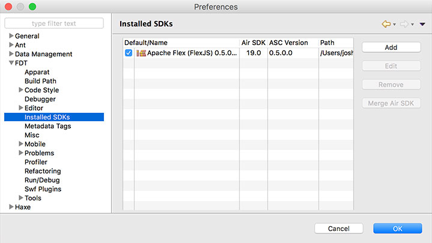
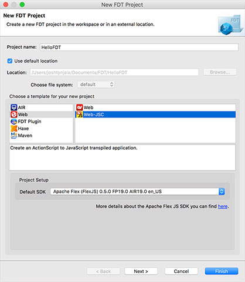

# How to create a project in FDT to transpile ActionScript
A tutorial written by [Josh Tynjala](https://patreon.com/josht)

[FDT](http://fdt.powerflasher.com/) has been a powerful development environment available to ActionScript developers for many years. Recently, <a href="http://fdt.powerflasher.com/2015/12/flexjs-compiler-support/">FDT added support for Apache FlexJS</a>, with a project template specifically for transpiling ActionScript and integrating with browser APIs. It even works with the free version of FDT!

If you'd prefer to use an IDE instead of [running the `asjsc` compiler on the command line](../hello-world-transpile-actionscript-apache-flexjs/index.md), FDT is now one of the easiest ways to get started.

This tutorial was made possible thanks to generous support from <a href="http://yeticgi.com/"><strong>YETi CGI</strong></a> and community members like you on <a href="https://patreon.com/josht">Patreon</a>.

## Requirements

For this tutorial, you should <a href="http://fdt.powerflasher.com/buy-download/">install <strong>FDT</strong></a>. A free version is available.

Additionally, you should install **Apache FlexJS 0.5 or newer**. Use the [Apache Flex SDK Installer](http://flex.apache.org/installer.html) to download it.

## Add Apache FlexJS to FDT

First, let's add Apache FlexJS as an SDK to FDT. We'll need to do that in the FDT preferences window.

1. On Mac, select the **FDT** menu → **Preferences...**. On Windows, select the **Window** menu → **Preferences...**

1. From the list on the left side of the Preferences window, open the **FDT** category and choose **Installed SDKs**.

1. On the right, press the **Add** button, and select the folder where you installed Apache FlexJS.

1. The **SDK Search Result** window will open, and you may customize how the SDK is named in FDT. The default values are generally acceptable, so press the **Add New SDKs** button at the bottom.

1. Press the **OK** button in the Preferences window to finish.

Everything should now be ready to create a new project that uses Apache FlexJS.

## Create a new project

Next, we'll create a new FDT project using Apache FlexJS.

1. Open the **File** menu → **New** → **New FDT project...**

1. Enter your **Project name**. For this example, you might choose `HelloFDT`.

1. In the section marked **Choose a template for your new project**, choose **Web** in the first list, and then choose **Web-JSC** in the second list.

1. For the **Default SDK** choose the Apache FlexJS SDK that you added in the FDT preferences.

1. Press the **Finish** button.

Your new project is now created. The main `HelloFDT.as` class will contain some sample code to get you started. In the next step, we'll run it in a web browser.

## Run the application

1. In the `FDT Explorer` where the project's file are listed, select the `HelloFDT.as` file in the `src` directory.

1. Select the **Run** menu → **Run As** → **FDT SWF Application**. While this menu item refers to a SWF file, rest assured that this type of project only creates HTML and JavaScript.

1. Choose the **HelloFDT-debug** launch configuration and press the **OK** button.

Your browser will launch and display a webpage that looks something like this:

Try pressing a button. Then, go back to the code, and try out a few more browser APIs in ActionScript!