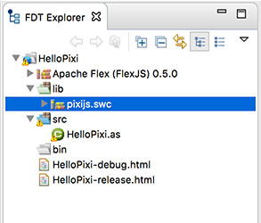
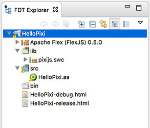
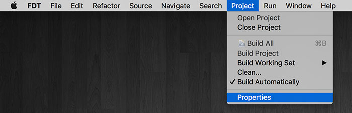
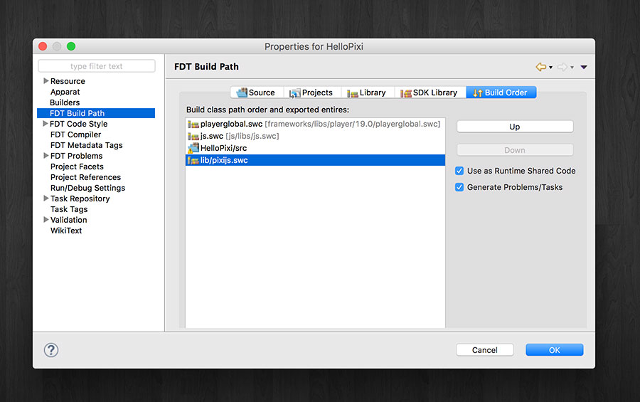

# How to add a SWC created with `dts2as` to an FDT project
A tutorial written by [Josh Tynjala](https://patreon.com/josht)

Previously, we learned [how to create a project in FDT](../fdt-ide-apache-flexjs-setup/index.md) and [how to create a SWC file for a JavaScript library with `dts2as`](../dts2as-typescript-definitions-with-actionscript/index.md). Let's take a moment to learn how to include a SWC file created with `dts2as` in an FDT project.

This tutorial was made possible thanks to generous support from <a href="http://yeticgi.com/"><strong>YETi CGI</strong></a> and community members like you on <a href="https://patreon.com/josht">Patreon</a>.

## Requirements

For this tutorial, you need <a href="http://fdt.powerflasher.com/buy-download/"><strong>FDT</strong></a>. A free version is available.

Additionally, you should install **Apache FlexJS 0.5 or newer**. Use the [Apache Flex SDK Installer](http://flex.apache.org/installer.html) to download it.

## Adding a `dts2as` SWC file

1. [Create a SWC file with `dts2as`](../dts2as-typescript-definitions-with-actionscript/index.md). For this tutorial, let's use the same `pixijs.swc` created in the previous tutorial about `dts2as`.

1. [Create a new project in FDT](../fdt-ide-apache-flexjs-setup/index.md). Since we're using Pixi.js, we might call it `HelloPixi`.

1. Copy the SWC file into the `lib` directory in your FDT project. This directory is created for you automatically.

	

1. Select your project in the **FDT Explorer**.

	

1. Open the **Project** menu and choose **Properties**.

	

1. From the list on the left, choose **FDT Build Path**.

	

1. Click the **Build Order** tab on the right.

1. Select the SWC file and check the box labeled **Use as Runtime Shared Code**.

	

The <em>Use as Runtime Shared Code</em> setting tells the compiler that the code for the JavaScript library will be provided at runtime. Don't forget to load the library with a <code>&lt;script&gt;</code> tag in your HTML file!

1. Click **OK** to save the project properties.

1. You can use the sample code from the [`dts2as` tutorial](../dts2as-typescript-definitions-with-actionscript/index.md) to verify that everything is working correctly.

## Common issues

When you try to run your project, you may see a compile-time error in the FDT console that looks similar to the following (your error may refer to a different class name):

<pre>ERROR File not found: PIXI.Container
ERROR Internal error: java.lang.RuntimeException: Unable to find JavaScript filePath for class: PIXI.Container</pre>

This error means that you did not check the box labeled **Use as Runtime Shared Code**. All SWC files created with `dts2as` must use this setting.