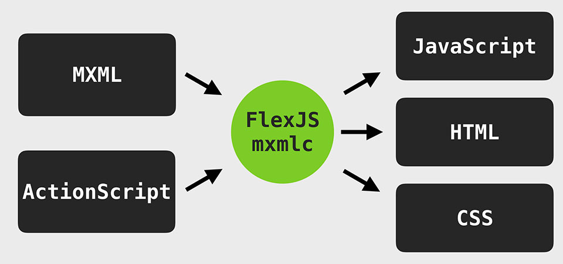
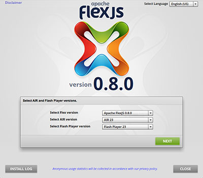
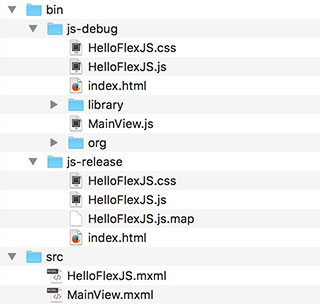
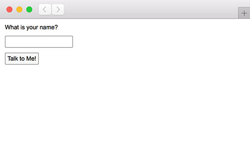
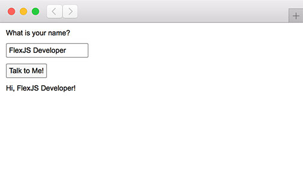

<div class="title-content">

# Hello FlexJS: Web application development with Apache FlexJS™, MXML, and ActionScript (no plug-ins required!)
A tutorial written by [Josh Tynjala](https://patreon.com/josht)

</div>

Switching away from MXML and ActionScript in the Flex SDK to HTML and JavaScript seems like a step backwards. MXML provides declarative UI with components and containers, data binding, and states. ActionScript provides classes, interfaces, and compile-time type checking. Wouldn't it be better if you could keep using these languages to target the web with the language that you prefer, except... no plug-ins required? That's what Apache FlexJS™ aims to do.

 asjsc => HelloWorld.js">

Apache FlexJS borrows what was great about the classic Flex SDK, and it adds in some new stuff like the "Pay As You Go" strand and bead system to help make applications use less memory and perform better by including only the features that you actually use.

<div class="container-fluid bg-info">

More interested in using pure ActionScript and targeting the HTML DOM and other JavaScript APIs directly without the FlexJS components? Check out these other two tutorials:

* [Hello World: How to transpile ActionScript to JavaScript for the web](../hello-world-transpile-actionscript-apache-flexjs/index.md)
* [How to use transpiled ActionScript with HTML](../html-with-transpiled-actionscript/index.md).

</div>

## Install Apache FlexJS

First, install **Apache FlexJS 0.8** or newer. The [Apache Flex SDK Installer](http://flex.apache.org/installer.html) can walk you through the installation process:

<a href="http://flex.apache.org/installer.html"></a>

Alternatively, if you have Node.js installed, you may use the following command to install the latest version of Apache FlexJS from the command line:

```
npm install -g flexjs
```

## Create a new project

1. Create a new folder for your project, and name it `HelloFlexJS`.

1. Inside the new project, create a new folder named `src`. This is where our ActionScript classes will go.

1. Inside the `src` folder, create a file named `HelloFlexJS.mxml`, and add the following code:

	``` mxml
	<?xml version="1.0" encoding="utf-8"?>
	<js:Application xmlns:fx="http://ns.adobe.com/mxml/2009"
		xmlns:js="library://ns.apache.org/flexjs/express"
		xmlns:local="*">
		<js:initialView>
			<local:MainView/>
		</js:initialView>
	</js:Application>
	```

	This MXML class will be the entry point of our FlexJS application. On startup, the `Application` component loads a single, initial view. In our case, we're loading a component named `MainView` that we'll create next.

1.  Create another file in the `src` folder, and name it `MainView.mxml`. Then, add the following content:

	``` mxml
	<?xml version="1.0" encoding="utf-8"?>
	<js:View xmlns:fx="http://ns.adobe.com/mxml/2009"
		xmlns:js="library://ns.apache.org/flexjs/express">
		<js:beads>
			<js:VerticalLayoutWithPaddingAndGap gap="10"
				paddingTop="10" paddingRight="10" paddingBottom="10" paddingLeft="10"/>
		</js:beads>
		<js:states>
			<js:State name="default"/>
			<js:State name="talked"/>
		</js:states>

		<js:Label text="What is your name?"/>
		<js:TextInput id="nameInput"/>
		<js:TextButton text="Talk to Me!" click="talkButton_clickHandler(event)"/>
		<js:Label text="Hi, {nameInput.text}!" visible="false" visible.talked="true"/>

		<fx:Script>
			<![CDATA[
				import org.apache.flex.events.MouseEvent;

				private function talkButton_clickHandler(event:MouseEvent):void
				{
					currentState = "talked";
				}
			]]>
		</fx:Script>
	</js:View>
	```

There's a lot going on here, so let's break it down into separate parts.

### Containers and children

We add several components as children of the view, including two `Label` components, a `TextInput`, and a `TextButton`. Here's a simplified version of the code above with all of the properties, events and extra stuff removed:

``` mxml
<js:View>
	<js:Label/>
	<js:TextInput/>
	<js:TextButton/>
	<js:Label/>
</js:View>
```

The `View` component is the container, and it has four child components nested inside as XML elements.


<div class="container-fluid bg-info">Containers may include other containers as children too, and those containers can have their own children and different layouts.</div>

### Setting properties

We set a number of properties on the components, like displaying "What is your name?" in the first `Label` component:

``` mxml
<js:Label text="What is your name?"/>
```

We simply set the `text` property as an XML attribute. Alternatively, we could create the same `Label` component and set its `text` property like this:

``` mxml
<js:Label>
	<js:text>What is your name?</js:text>
</js:Label>
```

### Events

We call a function named `talkButton_clickHandler()` when the `TextButton` component is clicked.

``` mxml
<js:TextButton text="Talk to Me!" click="talkButton_clickHandler(event)"/>
```

You can see that this function is defined in an `<fx:Script>` block that can contain ActionScript code:

``` mxml
<fx:Script>
	<![CDATA[
		import org.apache.flex.events.MouseEvent;

		private function talkButton_clickHandler(event:MouseEvent):void
		{
			currentState = "talked";
		}
	]]>
</fx:Script>
```

### Component IDs

We can optionally give a component an `id`, which allows us to reference it in ActionScript code:

``` mxml
<js:TextInput id="nameInput"/>
```

We can use the `nameInput` id as a variable in our ActionScript when we want to refer to this `TextInput`. For example, we could copy the `text` property to a local variable:

``` actionscript
var text:String = nameInput.text;
```

We'll look at "data binding" in just a moment, and we'll see another example of using `nameInput` as a variable in ActionScript.

### Data Binding

We use `{}` curly braces to bind the value of the `text` property from the `TextInput` component to the `text` property of one of our `Label` components. Every time that the value of the `TextInput` changes, the `Label` will be updated automatically.

``` mxml
text="Hi, {nameInput.text}!"
```

Data binding in MXML saves you time by helping you to avoid manually adding event listeners.

### States

At the top of the component, we defined two states, named "default" and "talked".

``` mxml
<js:states>
	<js:State name="default"/>
	<js:State name="talked"/>
</js:states>
```

We use these states to determine if one of the `Label` components should be visible or not:

``` mxml
visible="false" visible.talked="true"
```

By default, the `Label` is hidden because we set the `visible` property to `false`. However, you can see that the `visible` property of the `Label` should automatically change to `true` when the component enters the "talked" state. MXML supports special syntax to specify that a property should have a different values in different states, in the following format: `propertyName.stateName="value"`.

Finally, when the `TextButton` is clicked, that's when we tell our view to switch to its "talked" state:

``` actionscript
private function talkButton_clickHandler(event:MouseEvent):void
{
	currentState = "talked";
}
```

### Beads

As you gain experience with FlexJS, you'll learn more about strands and beads. FlexJS prefers composition over inheritance, and components can be enhanced by adding beads that do things like add new features or change the component's behavior. In our component, we add a layout bead:

``` mxml
<js:beads>
	<js:VerticalLayoutWithPaddingAndGap gap="10"
		paddingTop="10" paddingRight="10" paddingBottom="10" paddingLeft="10"/>
</js:beads>
```

Beads can be things like data models, transformations, layouts, tool-tips, and other features that might be considered optional for some components. For example, not all `TextInput` components need to display a password, so you'll need to add a `PasswordInputBead` to a specific `TextInput` when you need it.

<div class="container-fluid bg-info">

This is what the FlexJS team calls "pay as you go" (PAYG), and it helps keep the memory and performance of your application under control because only the features that you need are included in the final output.

</div>

## Compile the application on the command line

Inside the Apache FlexJS SDK, the `js/bin` folder contains several different executables used to transpile ActionScript to JavaScript.

<div class="container-fluid bg-info">

What do each of those executables in `js/bin` do?

* `mxmlc` compiles applications that use the Apache FlexJS framework components. **We'll use this one.**
* `asjsc` compiles pure ActionScript to JavaScript with access to [web browser APIs like the HTML DOM](../html-with-transpiled-actionscript/index.md).
* `asnodec` compiles pure ActionScript to JavaScript with [access to Node.js APIs](../hello-nodejs-transpile-actionscript-asnodec/index.md) to create server-side or command line projects.

</div>

Use the `mxmlc` executable to transpile the `HelloFlexJS.mxml` file that you created above.

	mxmlc -targets=JSFlex src/HelloFlexJS.mxml

This will produce a folder named `bin` containing `js-debug` and `js-release` folders. The `js-debug` folder contains JavaScript that is easy to read, and each class is loaded at runtime from a separate file. The `js-release` folder contains JavaScript that has been concatenated and minified for production.

The project should now contain the following files and folders:



<div class="container-fluid bg-info">

The `-targets=JSFlex` option tells the compiler to generate JavaScript output only. By default, FlexJS generates both JavaScript for web browsers and a SWF file for Adobe AIR or Flash Player. For this tutorial, there's no need for SWF output.

</div>

## Run the application

Open up `bin/js-debug/index.html` or `bin/js-release/index.html` in a web browser. You should see something like this:



Give focus to the `TextInput` component and type your name. Then, click the "Talk to Me" button. You'll see the `Label` component appear with a message:



Your MXML and ActionScript code is now running as JavaScript in a web browser!

<div class="container-fluid bg-info">

**Hey!** Remember how we used data binding with `{}` curly braces? Go back to the `TextInput` component again and type someone else's name. Notice that the `Label` updates in real time as you type!

</div>

## What's Next?

This is just a simple example, but it gives you a glimpse of how developing web applications with Apache FlexJS keeps all the core principles of the classic Flex SDK and MXML... except there's no plug-in required! Keep using MXML and ActionScript. It increases your productivity with features like data binding, states, and more. It helps you build larger and more ambitious projects. Embrace the web on your own terms.

Looking for a good editor or IDE? Check out [Visual Studio Code](https://marketplace.visualstudio.com/items?itemName=bowlerhatllc.vscode-as3mxml).

Curious about the debugging experience? If you're using Visual Studio Code, you an actually add breakpoints inside the editor and [debug with Chrome](https://github.com/BowlerHatLLC/vscode-as3mxml/wiki/Debug-a-transpiled-ActionScript-project-in-Visual-Studio-Code-with-Google-Chrome). Debugging in more IDEs and browsers will be supported in the next version of FlexJS.