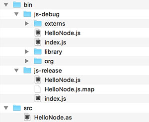

<div class="title-content">

# Hello Node: How to transpile ActionScript for Node.js
A tutorial written by [Josh Tynjala](https://patreon.com/josht)

</div>

Over the years, many developers have dreamed of using ActionScript on both the client *and* the server. Today, the Apache FlexJS™ SDK finally makes it possible. Previously, we learned [how to transpile pure ActionScript for HTML in the web browser](../hello-world-transpile-actionscript-apache-flexjs/index.md) using `asjsc`. Let's learn to use `asnodec` to write ActionScript code that runs in the popular server-side JavaScript environment, [Node.js](http://nodejs.org).


With `asnodec`, we'll get full access to all Node.js APIs, and it's even possible to require npm modules in ActionScript. We'll start with a simple example.

<div class="container-fluid bg-info">This tutorial was made possible thanks to generous support from <a href="http://moonshine-ide.com/"><strong>Moonshine IDE</strong></a>, <a href="http://yeticgi.com/"><strong>YETi CGI</strong></a> and community members like you on <a href="https://patreon.com/josht">Patreon</a>.</div>

## Requirements

For this tutorial, you should install [**Node.js**](https://nodejs.org/). The newest Long Term Support (LTS) release is recommended.

Additionally, you will need **Apache FlexJS 0.8 or newer**. Use the [Apache Flex SDK Installer](http://flex.apache.org/installer.html), or download it from Node Package Manager with `npm install -g flexjs`.

## Create a new project

1. Create a new, empty folder for your project, and name it `HelloNode`.

1. Inside the new project, create a new folder named `src`. This is where our ActionScript classes will go.

1. Inside the `src` folder, create a file named `HelloNode.as`, and add the following code:

	``` actionscript
	package
	{
		public class HelloNode
		{
			public function HelloNode()
			{
				console.log("Hello", process.release.name, process.version);
				dns.lookup("localhost", null, dnsLookupCallback);
			}
			
			private function dnsLookupCallback(error:Object, address:String):void
			{
				console.log("The address of localhost is:", address);
			}
		}
	}
	```

In this class, we're doing two things. First, we're printing the version of Node to the console. Then, we're using Node's built-in [`dns`](https://nodejs.org/api/dns.html) module to look up an IP address.

<div class="container-fluid bg-info">It is not necessary to call <code>require()</code> for Node modules in ActionScript. The compiler will detect when a module is used, and it will generate the appropriate call to <code>require()</code> automatically when generating the final JavaScript.</div>

## Compile the project on the command line

Inside the Apache FlexJS SDK, the `js/bin` folder contains several different exeuctables used to transpile ActionScript to JavaScript.

<div class="container-fluid bg-info">

What do each of those executables in `js/bin` do?

* `asjsc` compiles pure ActionScript to JavaScript with access to web browser APIs like the HTML DOM.
* `asnodec` compiles pure ActionScript to JavaScript with [access to Node.js APIs](../hello-nodejs-transpile-actionscript-asnodec/index.md) to create server-side or command line projects. **We'll use this one.**
* `mxmlc` compiles applications that use the Apache FlexJS framework components.

</div>

Use the `asnodec` executable to transpile the `HelloNode` ActionScript class that you created above for Node.js.

	asnodec src/HelloNode.as

This will produce a folder named `bin` containing `js-debug` and `js-release` folders. The `js-debug` folder contains JavaScript that is easy to read, and each class is loaded at runtime from a separate file. The `js-release` folder contains JavaScript that has been concatenated and minified for production.

The project should now contain the following files and folders:



Finally, let's try running our code with Node.js.

## Run the project

Inside the `js-debug` folder, a file named `index.js` will be created as the entry point for your Node.js project. You can run this script using the `node` executable:

	node bin/js-debug/index.js

You should see the following output in your console:

    Hello node v6.11.0
	The address of localhost is: 127.0.0.1

(The Node version number might be different, obviously!)

## What's Next?

This is just a simple example, but it gives you a glimpse of how developers can bring ActionScript server-side using Apache FlexJS and Node.js. By using an established ecosystem like Node.js, ActionScript developers can take advantage of all of the libraries published to NPM and join a large, vibrant community.