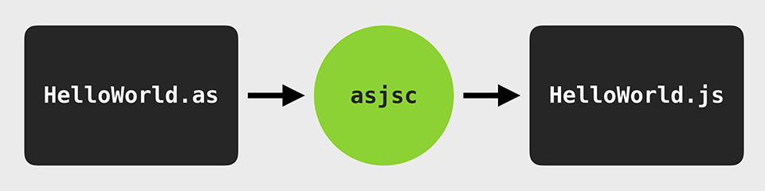
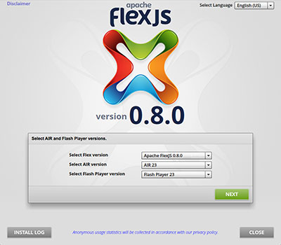
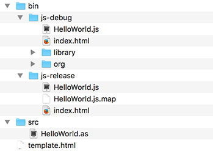
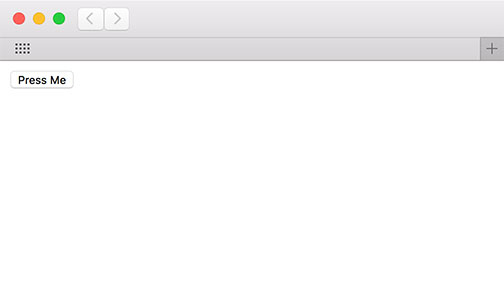
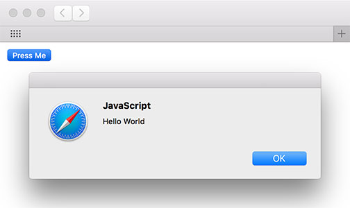

<div class="title-content">

# Hello World: How to transpile ActionScript to JavaScript for the web (no plug-ins required!)
A tutorial written by [Josh Tynjala](https://patreon.com/josht)

</div>

After years of working with a powerful language like ActionScript, JavaScript often feels like a downgrade. Wouldn't it be better if you could build HTML applications using proper classes, interfaces, and compile-time type checking? With the [Apache FlexJS™ SDK](https://cwiki.apache.org/confluence/display/FLEX/FlexJS), you can *transpile* ActionScript to JavaScript to keep targeting the web with the language that you prefer... no plug-ins required!

 asjsc => HelloWorld.js">

With the classic Apache Flex SDK, you could create a pure ActionScript project that didn't require the Flex framework, and you'd create interactive experiences using the display list APIs in Adobe Flash Player. With FlexJS, you can create a pure ActionScript project that gives you full access to the HTML DOM and other browser APIs, and it's even possible to reference JavaScript libraries that the HTML loads with `<script>` tags from your ActionScript code. To get an idea of how this all works, let's get started with a simple example.

<div class="container-fluid bg-info">

More interested in building applications using the components in the FlexJS framework? Check out this other tutorial:

* [Hello FlexJS: Web application development with Apache FlexJS, MXML, and ActionScript](../hello-flexjs-web-application-development-mxml-actionscript/index.md).

</div>

## Install Apache FlexJS

First, install **Apache FlexJS 0.8** or newer. The [Apache Flex SDK Installer](http://flex.apache.org/installer.html) can walk you through the installation process:

<a href="http://flex.apache.org/installer.html"></a>

Alternatively, if you have Node.js installed, you may use the following command to install the latest version of Apache FlexJS from the command line:

```
npm install -g flexjs
```

## Create a new project

1. Create a new folder for your project, and name it `HelloWorld`.

1. Inside the new project, create a new folder named `src`. This is where our ActionScript classes will go.

1. Inside the `src` folder, create a file named `HelloWorld.as`, and add the following code:

	``` actionscript
	package
	{
		public class HelloWorld
		{
			public function HelloWorld()
			{
				var button:HTMLButtonElement = document.createElement( "button" ) as HTMLButtonElement;
				button.innerHTML = "Press Me";
				document.body.appendChild( button );

				button.addEventListener( "click", button_clickListener, false );
			}

			private function button_clickListener( event:MouseEvent ):void
			{
				alert( "Hello World" );
			}
		}
	}
	```

This class will create a [`<button>`](https://developer.mozilla.org/en-US/docs/Web/HTML/Element/button), add it to the HTML page, and display an alert when the button is pressed.

Notice that variables are typed with JavaScript classes like [`HTMLButtonElement`](https://developer.mozilla.org/en-US/docs/Web/API/HTMLButtonElement) and [`MouseEvent`](https://developer.mozilla.org/en-US/docs/Web/API/MouseEvent). JavaScript functions like [`alert()`](https://developer.mozilla.org/en-US/docs/Web/API/Window/alert) can be called directly in ActionScript. Everything is strictly type-checked at compile time, so if the code contains any mistakes, the compiler will report an error.

In the next step, you'll create an HTML template file that can run the generated JavaScript code in a web browser.

## HTML Template

The compiler supports custom HTML templates that can be used to automatically inject the different `<script>` tags required for debug and release builds.

Create a file named `template.html` in the root of the project, and add the following content:

``` html
<!doctype html>
<html>
<head>
	<meta charset="utf-8"/>
	<title>Hello World</title>
${head}
</head>
<body>
${body}
</body>
</html>
```

When you compile the application in a moment, you'll tell the compiler to read this file. The compiler looks for the `${head}` and `${body}` tokens to figure out where to inject the `<script>` tags.

<div class="container-fluid bg-info">While the HTML template above includes very minimal markup, you could certainly <a href="../html-with-transpiled-actionscript/part-2-markup-and-stylesheets-transpiled-actionscript/">create a template with more complex HTML</a>, if needed.</div>

## Compile the application on the command line

Inside the Apache FlexJS SDK, the `js/bin` folder contains several different executables used to transpile ActionScript to JavaScript.

<div class="container-fluid bg-info">

What do each of those executables in `js/bin` do?

* `asjsc` compiles pure ActionScript to JavaScript with access to web browser APIs like the HTML DOM. **We'll use this one.**
* `asnodec` compiles pure ActionScript to JavaScript with [access to Node.js APIs](../hello-nodejs-transpile-actionscript-asnodec/index.md) to create server-side or command line projects.
* `mxmlc` compiles applications that use the Apache FlexJS framework components.

</div>

Use the `asjsc` executable to transpile the `HelloWorld` ActionScript class that you created above.

	asjsc -html-template=template.html src/HelloWorld.as

This will produce a folder named `bin` containing `js-debug` and `js-release` folders. The `js-debug` folder contains JavaScript that is easy to read, and each class is loaded at runtime from a separate file. The `js-release` folder contains JavaScript that has been concatenated and minified for production.

The project should now contain the following files and folders:



## Run the application

Open up `bin/js-debug/index.html` or `bin/js-release/index.html` in a web browser. You should see something like this:



Press the button, and the alert will be displayed:



Your ActionScript code is now running as JavaScript in a web browser!

## What's Next?

This is just a simple example, but it gives you a glimpse of how developing for web browsers without a plug-in doesn't need to be a step backwards. Keep using ActionScript. It increases your productivity. It helps you build larger and more ambitious projects. Embrace the web on your own terms.

If you want to learn more about pure ActionScript projects that target native JavaScript APIs and HTML, check out [How to use transpiled ActionScript with HTML](../html-with-transpiled-actionscript/index.md). If you're more interested in using the FlexJS framework components to develop applications with MXML, read through [Hello FlexJS: Web application development with Apache FlexJS, MXML, and ActionScript](../hello-flexjs-web-application-development-mxml-actionscript/index.md).

Curious about the debugging experience? You an actually add breakpoints to your original ActionScript and step through it using the web browser's built-in debugging tools! Check out [Debug transpiled ActionScript in Chrome using source maps](../source-maps-chrome-debug-actionscript/index.md) (you can [use sourcemaps with ActionScript in Firefox](../source-maps-firefox-debug-actionscript/index.md) too).

Looking for a good editor or IDE? Check out [Visual Studio Code](https://marketplace.visualstudio.com/items?itemName=bowlerhatllc.vscode-as3mxml), [FDT](../fdt-ide-apache-flexjs-setup/index.md), or [IntelliJ IDEA](../intellij-idea-apache-flexjs-transpile-actionscript-setup/index.md).