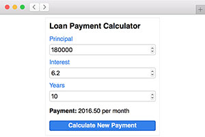

# How to use transpiled ActionScript with HTML
by Josh Tynjala

With pure ActionScript projects created with the Apache FlexJS™ SDK, we can build web apps and pages using ActionScript and HTML... no plugin required! HTML is the basic building block of the web, so it's important to understand how ActionScript can create it, modify it, and enhance it.

Let's learn how to combine transpiled ActionScript and HTML by building a simple HTML widget. It will be a loan payment calculator that takes some input values and calculates a result. We're going to build it three different ways, and in the process, we'll learn how well ActionScript can integrate with HTML in a web browser.

More interested in building applications using the components in the FlexJS framework? Check out this other tutorial:

* [Hello FlexJS: Web application development with Apache FlexJS, MXML, and ActionScript](../hello-flexjs-web-application-development-mxml-actionscript/index.md).

## Requirements

For this tutorial, you should install **Apache FlexJS 0.8 or newer**.  Use the [Apache Flex SDK Installer](http://flex.apache.org/installer.html), or download it from Node Package Manager with `npm install -g flexjs`.

## [Part 1: Build the HTML DOM in ActionScript](./part-1-build-the-html-dom-transpiled-actionscript/index.md)

In the first part, we'll build our HTML widget entirely in ActionScript code. We'll learn how to create HTML elements in ActionScript and add them to the HTML DOM.
	

		<a type="button" class="btn btn-primary" href="./part-1-build-the-html-dom-transpiled-actionscript/"> Read Part 1</a>
		<a type="button" class="btn btn-default" href="https://github.com/BowlerHatLLC/NextGenAS_LoanPaymentCalculator/tree/master/LoanPaymentCalculator_ActionScriptOnly/"> Get Code</a>
	

## [Part 2: Markup and style sheets with ActionScript](./part-2-markup-and-stylesheets-transpiled-actionscript/index.md)

Let's rebuild the same widget using real HTML markup and a style sheet, and we'll learn how to query the DOM with ActionScript to hook everything up.
	

		<a type="button" class="btn btn-primary" href="./part-2-markup-and-stylesheets-transpiled-actionscript/"> Read Part 2</a>
		<a type="button" class="btn btn-default" href="https://github.com/BowlerHatLLC/NextGenAS_LoanPaymentCalculator/tree/master/LoanPaymentCalculator_HTMLCSS/"> Get Code</a>
	

## [Part 3: Material Design Lite with ActionScript](./part-3-material-design-lite-transpiled-actionscript/index.md)

Finally, let's restyle the widget using a popular CSS framework. We'll use Google's Material Design Lite, but Bootstrap and others are easy to integrate too!
	

		<a type="button" class="btn btn-primary" href="./part-3-material-design-lite-transpiled-actionscript/"> Read Part 3</a>
		<a type="button" class="btn btn-default" href="https://github.com/BowlerHatLLC/NextGenAS_LoanPaymentCalculator/tree/master/LoanPaymentCalculator_MaterialDesignLite/"> Get Code</a>
	

