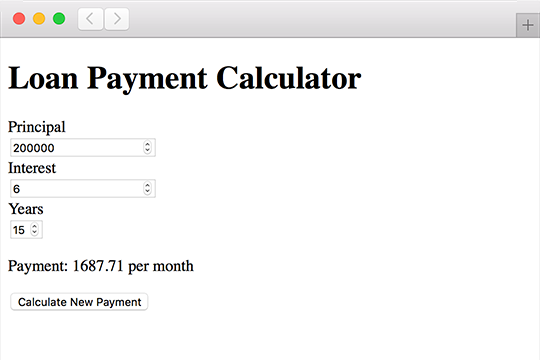
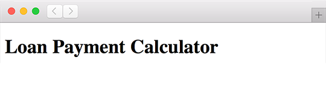

<div class="title-content">

# Part 1: Build the HTML DOM in ActionScript
How to use transpiled ActionScript with HTML  
A tutorial written by [Josh Tynjala](https://patreon.com/josht)

</div>

Breaking out of the plugin means a deeper integration with the web browser, HTML, and CSS. We're no longer stuck inside some black box container that has limited communication with the webpage that embeds it. Our projects are now a native part of the webpage, and that gives us a lot of power.

When we create a pure ActionScript project with the Apache FlexJS SDK, we have complete access to all JavaScript APIs, such as the DOM, networking, Canvas, SVG, and more. The compiler will check types for us, because FlexJS provides `js.swc`. It's basically a JavaScript version of `playerglobal.swc`, and it provides type information for all classes, methods, and properties on every JavaScript API in the web browser. This also means that our IDE can provide API suggestions as we type.



This is the first of a series of tutorials about [how to integrate HTML and transpiled ActionScript](../index.md). We'll get started by building a simple HTML widget that calculates the monthly payment for a loan purely in ActionScript using HTML DOM APIs.

## Source Code

Find the [complete source code](https://github.com/BowlerHatLLC/NextGenAS_LoanPaymentCalculator/tree/master/LoanPaymentCalculator_ActionScriptOnly/) for this tutorial on Github. We'll break the code into bite-sized chunks (with detailed explanations) below. However, to see the bigger picture, feel free to dive into the full project.

## A simple HTML file

Since we're building the form entirely in ActionScript code, our HTML file will be very simple. If we wanted to, we could use real HTML markup to create the form instead. We'll see how that works in [part 2](../part-2-markup-and-stylesheets-transpiled-actionscript/index.md), so stay tuned!

Here's what our simple HTML looks like for a debug build:

``` html
<!doctype html>
<html>
	<head>
		<meta charset="utf-8"/>
		<title>Loan Payment Calculator</title>
${head}
	</head>
	<body>
${body}
	</body>
</html>
```

Put this code into a file named `template.html` in your project's root directory. We'll pass this to the compiler later, and it will automatically populate the `${head}` and `${body}` tokens with the real `<script>` tags needed for our code.

## Hello, ActionScript!

Let's create our main ActionScript class. We'll call it `LoanPaymentCalculator`.

``` actionscript
package
{
	public class LoanPaymentCalculator
	{
		public function LoanPaymentCalculator()
		{
		}
	}
}
```

Create a directory named `src` and add this code to a file named `LoanPaymentCalculator.as`.

In the HTML file that we looked at a moment ago, you can see where we instantiate the `LoanPaymentCalculator` class. This constructor can be considered the main entry point for our code.

## How to create DOM elements in ActionScript

Inside the `LoanPaymentCalculator` constructor, let's start building our UI by creating an [`HTMLFormElement`](https://developer.mozilla.org/en-US/docs/Web/API/HTMLFormElement) and adding it to the page.

``` actionscript
var calculatorForm:HTMLFormElement = document.createElement("form") as HTMLFormElement;
document.body.appendChild(calculatorForm);
```

This will be the main container for everything in the widget.

Next, we'll create a heading element and add it to the form.

``` actionscript
var title:HTMLHeadingElement = document.createElement("h1") as HTMLHeadingElement;
title.textContent = "Loan Payment Calculator";
calculatorForm.appendChild(title);
```

To build the project, run the following command in the project's root directory:

```
asjsc -html-template=template.html src/LoanPaymentCalculator.as
```

If we open `bin/js-debug/index.html` in a web browser, we'll see the heading:



Next, let's add our first text input control to the form.

## Our first HTML input element

We should add a member variable to the `LoanPaymentCalculator` class for the first form control that we're going to create. We'll need to access its value later in our final calculation, so we need to store it somewhere:

``` actionscript
private var _principalInput:HTMLInputElement;
```

Back inside the constructor, let's start by creating the `_principalInput`. That's where the user will enter the total value of the loan.

``` actionscript
this._principalInput = document.createElement("input") as HTMLInputElement;
this._principalInput.type = "number";
this._principalInput.value = "200000";
this._principalInput.step = "1000";
calculatorForm.appendChild(this._principalInput);
```

This is an [`HTMLInputElement`](https://developer.mozilla.org/en-US/docs/Web/API/HTMLInputElement) with its `type` set to `"number"`. We'll set its `value`, and (for browsers that support it) the `step`.

<div class="container-fluid bg-info"><strong>Tip:</strong>The <code>step</code> property determines how much the number is incremented in browsers that display stepper controls. Not all browsers support this, including mobile browsers, but it's convenient for users on desktop.</div>

Let's also give the input an `id`. Not only will this allow it to be accessed with `document.getElementById()` and other DOM APIs, we'll also reference this `id` when we add a label to describe this input.

``` actionscript
this._principalInput.id = "principal-input";
```

Not only will this allow it to be accessed with `document.getElementById()` and other DOM APIs, we'll also reference this `id` when we add a label to describe this input.

Before the `_principalInput`, let's create an [`HTMLLabelElement`](https://developer.mozilla.org/en-US/docs/Web/API/HTMLLabelElement) with some descriptive text:

``` actionscript
var principalLabel:HTMLLabelElement = document.createElement("label") as HTMLLabelElement;
principalLabel.htmlFor = "principal-input";
principalLabel.textContent = "Principal";
principalLabel.style.display = "block";
calculatorForm.appendChild(principalLabel);

//add the label before _principalInput
this._principalInput = document.createElement("input") as HTMLInputElement;
```

The `htmlFor` property lets us associate the label with an input for accessibility. We'll use the `textContent` property to set the text to be displayed in the label, and we'll tweak the `display` style to make the label appear on its own line before the `_principalInput`.

## Add the other input elements

Let's quickly add the `_interestInput`, the `_yearsInput`, and their labels. The code is very similar. First, we'll define the member variables:

``` actionscript
private var _interestInput:HTMLInputElement;
private var _yearsInput:HTMLInputElement;
```

Then, we'll add some code in the constructor:

``` actionscript
var interestLabel:HTMLLabelElement = document.createElement("label") as HTMLLabelElement;
interestLabel.htmlFor = "interest-input";
interestLabel.textContent = "Interest";
interestLabel.style.display = "block";
calculatorForm.appendChild(interestLabel);
this._interestInput = document.createElement("input") as HTMLInputElement;
this._interestInput.id = "interest-input";
this._interestInput.type = "number";
this._interestInput.value = "6";
this._interestInput.step = "0.1";
calculatorForm.appendChild(this._interestInput);

var yearsLabel:HTMLLabelElement = document.createElement("label") as HTMLLabelElement;
yearsLabel.htmlFor = "years-input";
yearsLabel.textContent = "Years";
yearsLabel.style.display = "block";
calculatorForm.appendChild(yearsLabel);
this._yearsInput = document.createElement("input") as HTMLInputElement;
this._yearsInput.id = "years-input";
this._yearsInput.type = "number";
this._yearsInput.value = "15";
this._yearsInput.step = "5";
this._yearsInput.min = "10";
this._yearsInput.max = "50";
calculatorForm.appendChild(this._yearsInput);
```

One thing to note is that the `min` and `max` properties have been set in the `_yearsInput` to limit the range of possible values.

<div class="container-fluid bg-info"><strong>Tip:</strong> If the <code>min</code>, <code>max</code>, and <code>step</code> properties must be strictly enforced, consider adding some extra validation to your code to support older browsers.</div>

## Finishing up the form

Next, we want the result of the calculation to appear in an [`HTMLSpanElement`](https://developer.mozilla.org/en-US/docs/Web/API/HTMLSpanElement). Create another member variable for the span:

```
private var _paymentResultSpan:HTMLSpanElement;
```

Then, add the following code to the constructor:

``` actionscript
var paymentMessage:HTMLParagraphElement = document.createElement("p") as HTMLParagraphElement;
paymentMessage.textContent = "Payment: ";
this._paymentResultSpan = document.createElement("span") as HTMLSpanElement;
this._paymentResultSpan.id = "result-text";
this._paymentResultSpan.textContent = "1687.71";
paymentMessage.appendChild(this._paymentResultSpan);
paymentMessage.appendChild(document.createTextNode(" per month"));
calculatorForm.appendChild(paymentMessage);
```

We wrapped the span in an [`HTMLParagraphElement`](https://developer.mozilla.org/en-US/docs/Web/API/HTMLParagraphElement) with some additional descriptive text. Also, since the inputs were given default values, we'll display a default result as well.

Finally, we'll add the last UI control, an [`HTMLButtonElement`](https://developer.mozilla.org/en-US/docs/Web/API/HTMLButtonElement) to submit the form:

``` actionscript
var submitButton:HTMLButtonElement = document.createElement("button") as HTMLButtonElement;
submitButton.textContent = "Calculate New Payment";
calculatorForm.appendChild(submitButton);
```

If we build the project again, and open `bin/js-debug/index.html` in a web browser, we should see the entire form now:


It's not quite finished yet, though! The next step is to listen for when the form is submitted so that we can calculate the final result using the user-supplied values from the input elements.

## Calculate the monthly payment

The monthly payment for the loan will be calculated in the following method. It's a pretty standard formula that uses the principal value of the loan, the interest rate, and the duration of the loan, in years.

``` actionscript
private function calculatePayment(principal:Number, interestRate:Number, years:int):Number
{
	var effectiveInterestRate:Number = (interestRate / 100) / 12;
	var totalPaymentCount:int = years * 12;
	return principal * (effectiveInterestRate / (1 - Math.pow(1 + effectiveInterestRate, -totalPaymentCount)))
}
```

In a moment, we'll call this method when the form is submitted.

At the end of the constructor, listen for the form's `"submit"` event:

``` actionscript
calculatorForm.addEventListener("submit", form_submitHandler, false);
```

The event listener is where everything comes together. We'll take the user's input, do some calculations, and display the final result:

``` actionscript
private function form_submitHandler(event:Event):void
{
	event.preventDefault();

	var principal:Number = parseFloat(this._principalInput.value);
	var interestRate:Number = parseFloat(this._interestInput.value);
	var years:int = parseInt(this._yearsInput.value, 10);
	var payment:Number = calculatePayment(principal, interestRate, years);
	this._paymentResultSpan.textContent = payment.toFixed(2);
}
```

We start out by calling `event.preventDefault()`. This stops the browser from trying to submit the form to the server. In this case, we want to do all of our calculations client-side.

We request the value from each of the form's input controls. Because the value of an `HTMLInputElement` is a `String`, we'll use `parseFloat()` to convert it to a `Number`. If we need to validate these values in older browsers, this is the place do it. Modern browser automatically enforce numeric values.

Pass the values to the `calculatePayment()` method that we created a moment ago, and we'll finish by displaying the result in `_paymentResultSpan`.

## What's Next?

In [Part 2: Markup and stylesheets with transpiled ActionScript](../part-2-markup-and-stylesheets-transpiled-actionscript/index.md), we'll rebuild the same widget in a different way. This time, we created the form entirely in ActionScript by using HTML DOM APIs like `document.createElement()`. In the next part, we'll create the form in HTML markup, and we'll query the DOM with APIs like `document.getElementById()` in ActionScript to gain access to the input controls in the form.

If you want to dig into the example above a little deeper, download the [complete source code for Part 1](https://github.com/BowlerHatLLC/NextGenAS_LoanPaymentCalculator/tree/master/LoanPaymentCalculator_ActionScriptOnly/) on Github. [The repository](https://github.com/BowlerHatLLC/NextGenAS_LoanPaymentCalculator/) contains the code from all three parts of this tutorial. Go ahead and study everything in context, and compare the different techniques.

<p class="btn-set">
<a type="button" class="btn btn-primary" href="../part-2-markup-and-stylesheets-transpiled-actionscript/"><span class="glyphicon glyphicon-book" aria-hidden="true"></span> Read Part 2</a>
<a type="button" class="btn btn-default" href="https://github.com/BowlerHatLLC/NextGenAS_LoanPaymentCalculator/tree/master/LoanPaymentCalculator_ActionScriptOnly/"><span class="glyphicon glyphicon-flash" aria-hidden="true"></span> Download the Code</a>
<a type="button" class="btn btn-default" href="../"><span class="glyphicon glyphicon-arrow-up" aria-hidden="true"></span> Return to Intro</a>
</p>