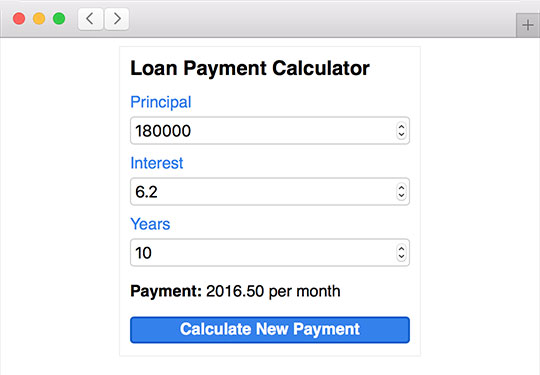

<div class="title-content">

# Part 2: Markup and stylesheets with transpiled ActionScript
How to use transpiled ActionScript with HTML  
A tutorial written by [Josh Tynjala](https://patreon.com/josht)

</div>

This is the second part in an ongoing series of tutorials about [how to integrate HTML and transpiled ActionScript](../index.md). In [Part 1: Build the HTML DOM in ActionScript](../part-1-build-the-html-dom-transpiled-actionscript/index.md), we learned how to create HTML elements on the page using only ActionScript code. We ended up with a simple widget that calculates the monthly payment for a loan. We're going to rebuild the same HTML widget from scratch, but this time around, we're going to use real HTML markup and a stylesheet.



ActionScript will help us find the elements that were created in HTML, and then we'll hook up all of the appropriate events and perform the final calculation. In other words, we'll let HTML and CSS do what they do best, and likewise, ActionScript will provide the business logic that brings it all together.

## Source Code

Find the [complete source code](https://github.com/BowlerHatLLC/NextGenAS_LoanPaymentCalculator/tree/master/LoanPaymentCalculator_HTMLCSS/) for this tutorial on Github. We'll break the code into bite-sized chunks (with detailed explanations) below. However, to see the bigger picture, feel free to dive into the full project.

## Creating the HTML document

Rather than create all of the HTML elements in our constructor using ActionScript, let's build the document with real HTML. We created an HTML template file in [Part 1](../part-1-build-the-html-dom-transpiled-actionscript/index.md), but it was pretty minimal. To refresh your memory, it is copied again below:

``` html
<!doctype html>
<html>
	<head>
		<meta charset="utf-8"/>
		<title>Loan Payment Calculator</title>
${head}
	</head>
	<body>
${body}
	</body>
</html>
```

This time, we're going to add some more content. At the beginning of the `<body>` element, but before the `${body}` compiler token, we'll add a new `<form>` containing the various controls that we need:

``` html
<form id="calculator-form">
	<h1>Loan Payment Calculator</h1>
	<div>
		<label for="principal-input">Principal</label>
		<input id="principal-input" type="number" value="200000" step="1000">
	</div>
	<div>
		<label for="interest-input">Interest</label>
		<input id="interest-input" type="number" value="6.0" step="0.1">
	</div>
	<div>
		<label for="years-input">Years</label>
		<input id="years-input" type="number" value="15" step="5" min="10" max="50">
	</div>
	<p><strong>Payment:</strong> <span id="result-text">1687.71</span> per month</p>
	<button>Calculate New Payment</button>
</form>
```

You may recall that we manually created all of these elements using ActionScript last time. By creating the form using HTML markup instead, it's easier to visualize the hierarchy of the DOM, and we'll soon end up with significantly less ActionScript code to read (compared to that big constructor from last time).

## Querying the HTML DOM

With all of the form controls created in markup instead of ActionScript, we need to find a way to access them in ActionScript so that we can listen for events and read their values. Let's simplify the class we created in [Part 1](../part-1-build-the-html-dom-transpiled-actionscript/index.md).

Start out by removing all of the code from the `LoanPaymentCalculator` constructor:

``` actionscript
public function LoanPaymentCalculator()
{
}

private var _principalInput:HTMLInputElement;
private var _interestInput:HTMLInputElement;
private var _yearsInput:HTMLInputElement;
private var _paymentResultSpan:HTMLSpanElement;
```

We'll keep the member variables that stored the form controls, but we need to initialize them somehow. Inside the constructor, we'll query the document for each control:

``` actionscript
this._principalInput = document.getElementById("principal-input") as HTMLInputElement;
this._interestInput = document.getElementById("interest-input") as HTMLInputElement;
this._yearsInput = document.getElementById("years-input") as HTMLInputElement;
this._paymentResultSpan = document.getElementById("result-text") as HTMLSpanElement;
```

In the markup, we gave each of the form controls an `id`. We pass that to [`getElementById()`](https://developer.mozilla.org/en-US/docs/Web/API/Document/getElementById) to find the underlying [`HTMLElement`](https://developer.mozilla.org/en-US/docs/Web/API/HTMLElement) (which can be cast to a more specific type, if needed, and we do exactly that in the code above).

Similarly, we'll query the document for `<form>` element, and then we'll add an event listener to know when it is submitted:

``` actionscript
var calculatorForm:HTMLFormElement = document.getElementById("calculator-form") as HTMLFormElement;
calculatorForm.addEventListener("submit", form_submitHandler, false);
```

The other methods in the `LoanPaymentCalculator` class remain exactly the same:

``` actionscript
private function calculatePayment(principal:Number, interestRate:Number, years:int):Number
{
	var effectiveInterestRate:Number = (interestRate / 100) / 12;
	var totalPaymentCount:int = years * 12;
	return principal * (effectiveInterestRate / (1 - Math.pow(1 + effectiveInterestRate, -totalPaymentCount)))
}

private function form_submitHandler(event:Event):void
{
	event.preventDefault();

	var principal:Number = parseFloat(this._principalInput.value);
	var interestRate:Number = parseFloat(this._interestInput.value);
	var years:int = parseInt(this._yearsInput.value, 10);
	var payment:Number = calculatePayment(principal, interestRate, years);
	this._paymentResultSpan.textContent = payment.toFixed(2);
}
```

## A stylesheet

Let's add some basic styling with a stylesheet. Add the following markup to the `<head>` section:

``` html
<link rel="stylesheet" href="../../css/styles.css">
```

Then, create a directory named `css` in the root directory your project and copy [`styles.css`](https://github.com/BowlerHatLLC/NextGenAS_LoanPaymentCalculator/tree/master/LoanPaymentCalculator_HTMLCSS/css/styles.css) from [the Github repository](https://github.com/BowlerHatLLC/NextGenAS_LoanPaymentCalculator/tree/master/LoanPaymentCalculator_HTMLCSS/).

Open `bin/js-debug/index.html` in your browser, and you should see something like this:


That's it! The form should work the same as the previous example. However, now we have much less ActionScript, and it focuses specifically on listening to events and calculating the result. The markup is easier to read than ActionScript that calls `document.createElement()`, and the styles are separated out into their own separate file instead of cluttering up our code or markup. Each part of our project (the code, the markup, and the stylesheet) is focusing on what it does best.

## What's Next?

In [Part 3: Integrate Material Design Lite with ActionScript](../part-3-material-design-lite-transpiled-actionscript/index.md), we'll revisit the same widget a third time — but we'll discover another way to manage its styles. We'll actually end up keeping the exact same ActionScript code, but we'll style the form using Material Design Lite, the popular CSS framework created by Google.

If you want to dig into the example above a little deeper, download the [complete source code for Part 2](https://github.com/BowlerHatLLC/NextGenAS_LoanPaymentCalculator/tree/master/LoanPaymentCalculator_HTMLCSS/) on Github. [The repository](https://github.com/BowlerHatLLC/NextGenAS_LoanPaymentCalculator/) contains the code from all three parts of this tutorial. Go ahead and study everything in context, and compare the different techniques.

<p class="btn-set">
<a type="button" class="btn btn-primary" href="../part-3-material-design-lite-transpiled-actionscript/"><span class="glyphicon glyphicon-book" aria-hidden="true"></span> Read Part 3</a>
<a type="button" class="btn btn-default" href="https://github.com/BowlerHatLLC/NextGenAS_LoanPaymentCalculator/tree/master/LoanPaymentCalculator_HTMLCSS/"><span class="glyphicon glyphicon-flash" aria-hidden="true"></span> Download the Code</a>
<a type="button" class="btn btn-default" href="../"><span class="glyphicon glyphicon-arrow-up" aria-hidden="true"></span> Return to Intro</a>
</p>