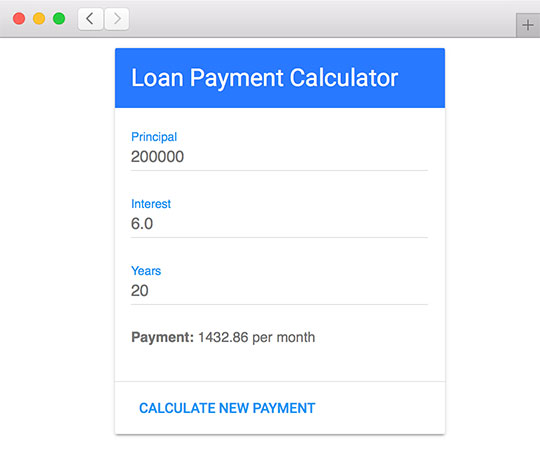

<div class="title-content">

# Part 3: Integrate Material Design Lite with ActionScript
How to use transpiled ActionScript with HTML  
A tutorial written by [Josh Tynjala](https://patreon.com/josht)

</div>

This is the third part in an ongoing series of tutorials about [how to integrate HTML and transpiled ActionScript](../index.md). In [Part 1: Build the HTML DOM in ActionScript](../part-1-build-the-html-dom-transpiled-actionscript/index.md) and [Part 2: Markup and stylesheets with transpiled ActionScript](), we learned two different ways to build a simple HTML widget that calculates the monthly payment for a loan. Whether creating a form by calling `document.createElement()` in ActionScript, or defining elements in real HTML markup and calling `document.getElementById()`, we know the most common ways to work with HTML in ActionScript.

In the final installment of this tutorial, we're going to revisit our widget a third time to discover another way to style it. We'll learn how to add Google's popular [Material Design Lite](https://www.getmdl.io/) library to our page.



This time around, our ActionScript code won't need any changes. We're focusing on purely visual changes this time, so we'll be modifying the markup and loading different styles.

## Source Code

Find the [complete source code](https://github.com/BowlerHatLLC/NextGenAS_LoanPaymentCalculator/tree/master/LoanPaymentCalculator_MaterialDesignLite/) for this tutorial on Github. We'll break the code into bite-sized chunks (with detailed explanations) below. However, to see the bigger picture, feel free to dive into the full project.

## What is Material Design Lite?

[Material Design Lite](https://www.getmdl.io/) was created by Google to make it easy to style a website following their [Material Design](https://www.google.com/design/spec/material-design/introduction.html) guidelines. Abbreviated as MDL, this CSS framework works well on both mobile and desktop, and it degrades gracefully on older web browsers. It's a great way to give your website an app-like look and feel with a familiar style.

First, add the following markup inside the `<head>` element of your HTML template file (before the `${head}` compiler token:

``` html
<link rel="stylesheet" href="https://code.getmdl.io/1.1.3/material.blue-amber.min.css">
<script defer src="https://code.getmdl.io/1.1.3/material.min.js"></script>
```

This loads the styles for Material Design Lite and some JavaScript that enhances the components, without relying on any heavy frameworks.

## Rebuilding the form

Let's start out by reworking our `<form>` container that's inside the `<body>` element. We're going to style it as an [MDL Card](https://getmdl.io/components/index.html#cards-section):

``` html
<form id="calculator-form" class="mdl-card mdl-shadow--2dp">
	<div class="mdl-card__title">
		<!-- header content will go here -->
	</div>
	<div class="mdl-card__supporting-text">
		<!-- main content will go here -->
	</div>
	<div class="mdl-card__actions mdl-card--border">
		<!-- footer content will go here -->
	</div>
</form>
```

We add `class="mdl-card mdl-shadow--2dp"` to the `<form>` element. This will style it like a "card", with a drop shadow to give it some depth.

Then, our content is divided into three sections:

- title
- supporting text
- actions

The "title" section is like a header for the card. Obviously, we'll display the title there, but we could also add a special background and other controls too.

``` html
<div class="mdl-card__title">
	<!-- header content will go here -->
</div>
```

The "supporting text" section is where we'll put the main controls of our form. We'll add our inputs here again in a moment.

``` html
<div class="mdl-card__supporting-text">
	<!-- main content will go here -->
</div>
```

The "actions" section is like a footer for the card. It's a good place to put the form's submit button, since that's the main action the user will take.

``` html
<div class="mdl-card__actions mdl-card--border">
	<!-- footer content will go here -->
</div>
```

### Title and actions content

Let's start by filling in sections for the title and actions.

The `mdl-card__title` class for the title tells MDL to style it like a title bar. We use the `mdl-card__title-text` class on the heading to ensure that the text is sized correctly for this purpose:

``` html
<div class="mdl-card__title">
	<h2 class="mdl-card__title-text">Loan Payment Calculator</h2>
</div>
```

The `mdl-card__actions` class creates a new section for buttons or other controls that trigger actions related to the card's content. The `mdl-card--border` class gives it a border to divide it from the rest of the card's content:

``` html
<div class="mdl-card__actions mdl-card--border">
	<button class="mdl-button mdl-js-button mdl-button--raised mdl-button--colored">Calculate New Payment</button>
</div>
```

We added our form's submit button to the actions container, with some extra CSS classes to set its styles. For complete details about how to style buttons with MDL, see [Material Design Lite Components: Buttons](https://getmdl.io/components/index.html#buttons-section).

### Supporting text content

In [Part 2](../part-2-markup-and-stylesheets-transpiled-actionscript/index.md), you may recall that we created several form controls with a `<label>` and an `<input>` inside a `<div>` element, like this:

``` html
<div>
	<label for="principal-input">Principal</label>
	<input id="principal-input" type="number" value="200000" step="1000">
</div>
```

With MDL, our markup won't change all that much. Mainly, we'll add some CSS classes to each element so that MDL knows to style them correctly:

``` html
<div class="mdl-textfield mdl-js-textfield mdl-textfield--floating-label">
	<label for="principal-input" class="mdl-textfield__label">Principal</label>
	<input id="principal-input" class="mdl-textfield__input" type="number" value="200000" step="1000">
</div>
```

For complete details about how to style inputs with MDL, see [Material Design Lite Components: Text Fields](https://getmdl.io/components/index.html#textfields-section).

## Tips & Tricks

If you'd like to use Google's [Roboto font](https://www.google.com/fonts#UsePlace:use/Collection:Roboto), you can load it from Google Fonts by adding the following markup inside your HTML file's `<head>` section:

``` html
<link rel="stylesheet" href="https://fonts.googleapis.com/css?family=Roboto:400,500">
```

In the markup above, we load the normal and medium weights. You are free to load additional styles, if required.

## Final Result

Go ahead and open `bin/js-debug/index.html` in your web browser. You should see something like this:


We've finished our loan payment calculator widget using transpiled ActionScript and HTML. No plugin required of course!

## What's Next?

[Material Design Lite](https://getmdl.io) isn't the only CSS framework out there. [Bootstrap](http://getbootstrap.com/) is another popular one that would be just as easy to use with transpiled ActionScript. Both MDL and Bootstrap offer great foundations to help you get started building a more app-like experience in the web browser.

While our project is only a little widget, it should give you a taste of what it's like to build a single page web application with transpiled ActionScript and HTML. For a more advanced application, we might also consider using the Apache FlexJS framework, which comes with many components that go far beyond basic HTML form controls. Stay tuned for an upcoming tutorial about FlexJS.

If you want to dig into the example above a little deeper, download the [complete source code for Part 3](https://github.com/BowlerHatLLC/NextGenAS_LoanPaymentCalculator/tree/master/LoanPaymentCalculator_MaterialDesignLite/) on Github. [The repository](https://github.com/BowlerHatLLC/NextGenAS_LoanPaymentCalculator/) contains the code from all three parts of this tutorial. Go ahead and study everything in context, and compare the different techniques.

<p class="btn-set">
<a type="button" class="btn btn-primary" href="https://github.com/BowlerHatLLC/NextGenAS_LoanPaymentCalculator/LoanPaymentCalculator_MaterialDesignLite/"><span class="glyphicon glyphicon-flash" aria-hidden="true"></span> Download the Code</a>
<a type="button" class="btn btn-default" href="https://github.com/BowlerHatLLC/NextGenAS_LoanPaymentCalculator/"><span class="glyphicon glyphicon-flash" aria-hidden="true"></span> View Full Repository</a>
<a type="button" class="btn btn-default" href="../"><span class="glyphicon glyphicon-arrow-up" aria-hidden="true"></span> Return to Intro</a>
</p>