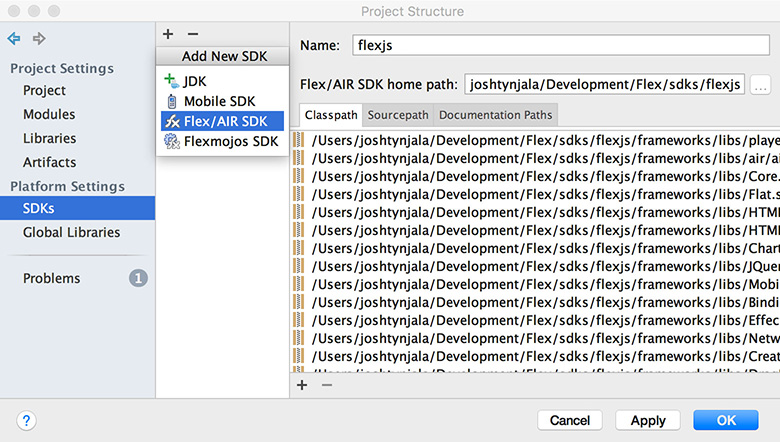
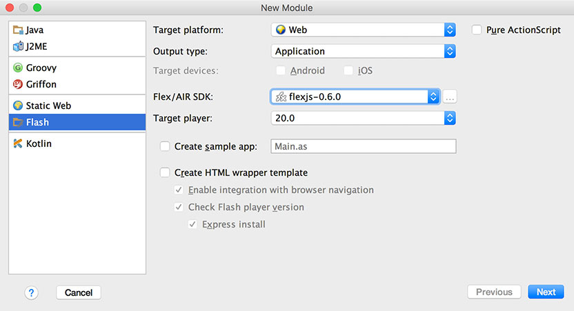
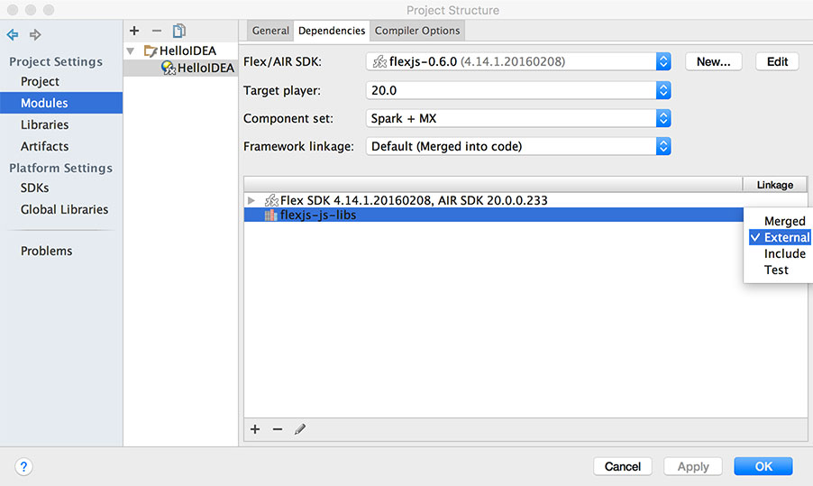
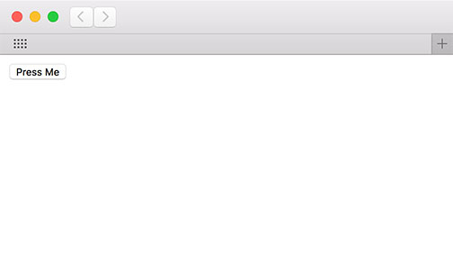

<div class="title-content">

# How to create a project in IntelliJ IDEA to transpile ActionScript to JavaScript for HTML and the web
A tutorial written by [Josh Tynjala](https://patreon.com/josht)

</div>

<div class="container-fluid bg-danger">

**Warning!** Apache FlexJS 0.8.0 currently has a bug that prevents it from compiling a project correctly in IntelliJ IDEA. In the meantime, you might consider trying [Visual Studio Code](https://marketplace.visualstudio.com/items?itemName=bowlerhatllc.vscode-as3mxml) instead.

</div>

Over the last several years, [IntelliJ IDEA](https://www.jetbrains.com/idea/) became one of the more popular development environments available to ActionScript developers. While Jetbrains hasn't fully optimized their IDE for the Apache FlexJS SDK yet, it only requires a few tweaks to reconfigure a module to transpile ActionScript to JavaScript and run it in a web browser.


If you'd prefer to use an IDE instead of [running the `asjsc` compiler on the command line](../hello-world-transpile-actionscript-apache-flexjs/index.md), IntelliJ IDEA is now a pretty good way to get started.

<!--<div class="container-fluid bg-info">

More interested in building applications using the components in the FlexJS framework? Check out [How to create an Apache FlexJS web application in IntelliJ IDEA](../intellij-idea-apache-flexjs-mxml-application-setup/index.md).

</div>-->

## Requirements

For this tutorial, you should <a href="https://www.jetbrains.com/idea/download/">install <strong>IntelliJ IDEA Ultimate</strong></a>. A free trial is available.

Additionally, you need **Apache FlexJS 0.8 or newer**. Use the [Apache Flex SDK Installer](http://flex.apache.org/installer.html), or download it from Node Package Manager with `npm install -g flexjs`.

<div class="container-fluid bg-info">

This tutorial was made possible thanks to generous support from [**Moonshine IDE**](http://moonshine-ide.com/), [**YETi CGI**](http://yeticgi.com/) and community members like you on [**Patreon**](https://patreon.com/josht).

</div>

## Add Apache FlexJS to IntelliJ IDEA

First, let's add Apache FlexJS as an SDK to IntelliJ IDEA. We'll need to do that in the IntelliJ IDEA preferences window.



1. Select the **File** menu → **Project Structure...**.

1. From the list on the left side of the Project Structure window, choose **SDKs** under **Platform Settings**.

1. In the middle column, press the **+** (plus sign) button, and choose **Flex/AIR SDK**.

1. Select the directory where you installed Apache FlexJS, and press the **OK** button.

1. In the list on the left of the Project Structure window, select the **Libraries** item under **Project Settings**.

1. In the middle column, press the **+** (plus sign) button, and choose **ActionScript/Flex**.

1. Inside the Apache FlexJS SDK, select `js/libs/js.swc`.

1. Press the **+** (plus sign) button to add another SWC to this library. Then, select `frameworks/libs/Language.swc` inside the Apache FlexJS SDK, and press the **OK** button.

1. Give the library a name that you can remember, such as `flexjs-js-libs`.

1. Press the **OK** button in the Project Structure window to finish.

Everything should now be ready to create a new module that uses the Apache FlexJS SDK.

## Create a new module

Next, we'll create a new IntelliJ IDEA module using Apache FlexJS.



1. Open the **File** menu → **New** → **Module...**

1. From the list on the left side of the New Module window, choose **Flash**.

1. For the **Target platform**, choose **Web**.

1. Ensure that **Pure ActionScript** is ***not*** checked.

1. For the **Output type**, choose **Application**.

1. For the **Flex/AIR SDK**, choose the Apache FlexJS SDK that you added in the previous section.

1. Check **Create sample app** and enter `HelloIDEA.as` for the name.

1. Ensure that **Create HTML wrapper template** is ***not*** checked.

1. Press the **Next** button.

1. Enter your **Module name**. For this example, let's choose `HelloIDEA`.

1. Press the **Finish** button.

The new module has now created, but we have a couple more things to configure.

## Configure module settings

Next, we'll tweak a few of the module's settings to make it work properly with Apache FlexJS.



1. Open the **File** menu → **Project Structure...**.

1. In the list on the left, choose **Modules** under **Project Settings**.

1. In the middle column, open your module's branch, and select it.

1. In the **General** tab, set the **Output folder** to your module's main directory. This will make it easier to run the transpiled code directly from IntelliJ IDEA.

1. Navigate to the **Dependencies** tab.

1. Press the **+** (plus sign) button and choose **Project or Global Library...**.

1. Select the `flexjs-js-libs` library that we defined earlier, and press the **OK** button.

1. In the **Linkage** column, change the `flexjs-js-libs` linkage to **External**.

1. Navigate to the **Compiler Options** tab.

1. From the **Locales** setting, remove **en_US**. There should be no locales selected.

1. Near the bottom, add the following arguments to **Additional compiler options**:
	``` code
	-targets=JS -load-config+=<Path to Apache FlexJS SDK>/ide/IDEA/intellij-config.xml
	```
	Replace `<Path to Apache FlexJS SDK>` with the real location of the SDK on your file system.

## Create your first class

1. Open `HelloIDEA.as` in `src` directory of your module.

1. Delete the entire contents of this file, and replace it with the following code:

``` code
package
{
    public class HelloIDEA
    {
        public function HelloIDEA()
        {
            var button:HTMLButtonElement = document.createElement( "button" ) as HTMLButtonElement;
            button.innerHTML = "Press Me";
            document.body.appendChild( button );

            button.addEventListener( "click", button_clickListener, false );
        }

        private function button_clickListener( event:MouseEvent ):void
        {
            alert( "Hello World" );
        }
    }
}
```

You'll notice, as you type, that IntelliJ IDEA suggests classes like `HTMLButtonElement` and its members like `innerHTML` and `addEventListener()` automatically. We can use web browser APIs in ActionScript!

## HTML Template

Create a file named `template.html` in the root of the project. Include the following markup:

``` html
<!doctype html>
<html>
<head>
	<meta charset="utf-8"/>
	<title>Hello IntelliJ IDEA</title>
${head}
</head>
<body>
${body}
</body>
</html>
```

When you compile the application in a moment, you'll tell the compiler to read this file. The compiler looks for the `${head}` and `${body}` tokens to figure out where to inject the `<script>` tags.

<div class="container-fluid bg-info">While the HTML template above includes very minimal markup, you could certainly <a href="../html-with-transpiled-actionscript/part-2-markup-and-stylesheets-transpiled-actionscript/">create a template with more complex HTML</a>, if needed.</div>

## Run the application

1. Open the **Run** menu → **Edit Configurations...**.

1. Press the **+** (plus sign) button and choose **JavaScript Debug**.

1. Set the **Name** to `HelloIDEA`.

1. Next to the **URL**, press the **...** button and choose the `debug.html` file that you created in the previous section.

1. For the **Browser** ensure that **Chrome** is selected. It may be called **Default** (but you should see the Chrome icon).

1. In the **Before launch** section, press the **+** (plus sign) button, and choose **Make**. This will tell IntelliJ IDEA to compile the project automatically before launching in Chrome.

1. Press **OK** in the Run/Debug Configurations window.

1. Open the **Run** menu → **Debug...**, and choose the **HelloIDEA** configuration. Google Chrome should open.

	<div class="container-fluid bg-info">You may need to install the <strong><a href="https://chrome.google.com/webstore/detail/jetbrains-ide-support/hmhgeddbohgjknpmjagkdomcpobmllji">JetBrains IDE Support extension</a></strong>. If it isn't already installed, switch back to IntelliJ IDEA. It should prompt you with a link to install this extension.</div>

You should see a webpage that looks something like this:



Try pressing the button to see what happens!

## Adding breakpoints

<div class="container-fluid bg-warning"><strong>Warning!</strong> Currently, when debugging inside IntelliJ IDEA, breakpoints may only be added to the generated JavaScript code. To add breakpoints to the original ActionScript, use the <code>-source-map</code> compiler option, and use your web browser's built-in debugging tools instead. Technically, IntelliJ IDEA supports source maps too, but unfortunately, it assumes that ActionScript must be debugged by running a SWF file.</div>

1. Open the **Run** menu → **Debug...**, and choose the **HelloIDEA** configuration. Google Chrome should open.

1. In IntelliJ IDEA, open <code>bin/js-debug/HelloIDEA.js</code>. This is one of the generated JavaScript files.
 
1. Try adding a breakpoint on the line where <code>alert()</code> is called in `HelloIDEA.js`.

1. Press the button on the page, and the debugger in IntelliJ IDEA will take over.

## Printing to the console

To print debug messages to the console in IntelliJ IDEA, you may use the standard ActionScript `trace()`, or you can call JavaScript functions like `console.log()` or `console.error()`.

Try changing the button's click event listener to print a debug message instead of showing an alert:

``` javascript
private function button_clickListener( event:MouseEvent ):void
{
    trace( "Hello World" );
}
```