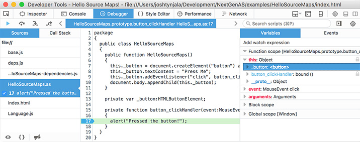
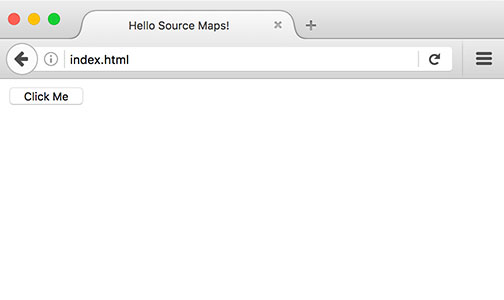
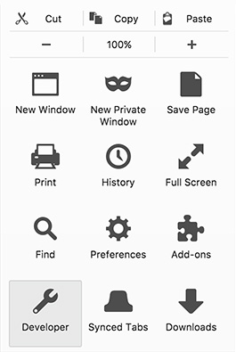
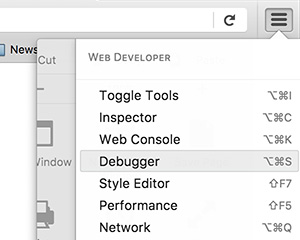
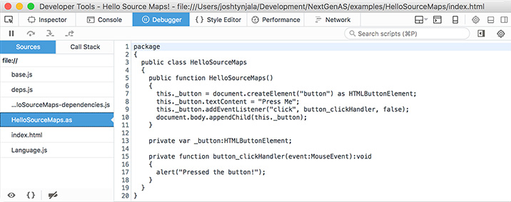
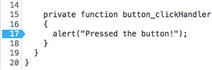

<div class="title-content">

# Debug transpiled ActionScript in Firefox with source maps
A tutorial written by [Josh Tynjala](https://patreon.com/josht)

</div>

With Apache FlexJS, we can write code in ActionScript instead of JavaScript, and we benefit from compile-time error checking and cool IDE features like code hinting. Writing code is only one part of a developer's job, though. We also spend a lot of time tracking down bugs in our code. Using the `trace()` function to display text in the console only gets us so far. Sometimes, we need a full-featured debugger with breakpoints, the call stack, and a list of all variables in scope.

All modern web browsers offer their own developer tools with a debugger for JavaScript, network logging, HTML inspection, and more. What if we're writing our project in ActionScript, though? With [source maps](https://developer.mozilla.org/en-US/docs/Tools/Debugger/How_to/Use_a_source_map), **the debugger can be taught to understand our ActionScript code**. It will run the JavaScript generated by the FlexJS compiler, but we'll see our original ActionScript code inside the debugger. We can add breakpoints to ActionScript functions, and the debugger will stop at the right place, even if the generated JavaScript for that function isn't on the same line.



Let's learn how to use the `-source-map` compiler argument and debug our ActionScript inside Firefox.

<div class="container-fluid bg-info">This tutorial was made possible thanks to generous support from <a href="http://moonshine-ide.com/"><strong>Moonshine IDE</strong></a>, <a href="http://yeticgi.com/"><strong>YETi CGI</strong></a> and community members like you on <a href="https://patreon.com/josht">Patreon</a>.</div>

## Requirements

For this tutorial, you should install **Apache FlexJS 0.8 or newer**. Use the [Apache Flex SDK Installer](http://flex.apache.org/installer.html), or download it from Node Package Manager with `npm install -g flexjs`.

Obviously, you will also need the [Mozilla Firefox](https://firefox.com/) web browser.

## Create a simple project

The main focus of this tutorial how to debug your code, so let's not spend a ton of time on how to set up a basic project. See the [Hello World tutorial](./hello-world-transpile-actionscript-apache-flexjs/index.md) if you need some more detailed instructions on how to get started.

1. Create a new folder for your project, and name it `HelloSourceMaps`.

1. Inside `HelloSourceMaps` folder, create a file named `template.html` with the following markup:

	``` html
	<!doctype html>
	<html>
	<head>
		<meta charset="utf-8"/>
		<title>Hello Source Maps!</title>
	${head}
	</head>
	<body>
	${body}
	</body>
	</html>
	```

<div class="container-fluid bg-info">For more information about this HTML template file, see <a href="../hello-world-transpile-actionscript-apache-flexjs/">Hello World: How to transpile ActionScript to JavaScript for the web (no plug-ins required!)</a></div>

1. Create a new folder named `src`, and add a file named `HelloSourceMaps.as` with the following code:

	``` actionscript
	package
	{
		public class HelloSourceMaps
		{
			public function HelloSourceMaps()
			{
				this._button = document.createElement("button") as HTMLButtonElement;
				this._button.textContent = "Press Me";
				this._button.addEventListener("click", button_clickHandler, false);
				document.body.appendChild(this._button);
			}

			private var _button:HTMLButtonElement;

			private function button_clickHandler(event:MouseEvent):void
			{
				alert("Pressed the button!");
			}
		}
	}
	```

## Compile with source maps

To compile the project for debugging, run the following command:

```
asjsc -source-map=true -debug=true -html-template=template.html src/HelloSourceMaps.as
```

The `-source-map=true` option tells the compiler to generate a <em>source map</em> for each class in the debug build.

As you probably know already, the compiler generates a separate JavaScript file in `bin/js-debug` for each ActionScript class. For instance, if you provide `MyClass.as`, the compiler will generate `MyClass.js`. When you use the `-source-map` option, the compiler will generate an additional file named `MyClass.js.map` that contains some cryptic-looking JSON. This is the source map for our ActionScript class.

The compiler will also generate a special comment that is added to the bottom of `MyClass.js`:

```
//# sourceMappingURL=./MyClass.js.map
```

When Firefox reads this comment, it will know to load `MyClass.js.map`. This file contains the location of the original ActionScript source file, and a compressed data structure that tells Firefox how the parts of the generated JavaScript map back to ActionScript. Line and column positions might change when compiled to JavaScript, and names of variables may not even be the same, but the source map can translate it all.

## Run in Firefox

Open `bin/js-debug/index.html` in Firefox. You should see a simple page, like this:



## Open developer tools

We're going to jump right into debugging our code.

1. Click Firefox's **menu button**  on the right side of the toolbar, and choose **Developer**.

	

1. Choose **Debugger** from the Web Developer menu that opens.

	

	<div class="container-fluid bg-info">Alternatively, use the <code>Ctrl+Alt+S</code> keyboard shortcut to open the debugger. (On macOS, it's <code>Cmd+Alt+S</code> instead).</div>

	The Firefox **Developer Tools** will open to the Debugger tab:

	

1. On the left side, in the **Sources** tab, open `HelloSourceMaps.as`. You will see the ActionScript source code that we wrote earlier. Yes, that's ActionScript displayed inside Firefox, thanks to source maps.

	<div class="container-fluid bg-info">While Firefox is actually running the generated JavaScript, it uses the source map file to determine where each line of JavaScript comes from in the original ActionScript. Debugging a SWF file works pretty much the same way, actually. The compiled bytecode running in Adobe Flash Player is mapped back to the original ActionScript by the debugger.</div>

## Add a breakpoint

1. On line 17, click the number 17 to add a breakpoint where `alert()` is called.

	

1. Go back to the webpage, and press the button. The debugger will stop at the breakpoint that we added:

	

On the right side of the debugger, you can see the **Variables** view that shows all variables that are in scope, including the listener's `event` parameter and the `_button` member variable on the `HelloSourceMaps` class.

**That's it!** We've written our code in ActionScript, and the Apache FlexJS compiler generates JavaScript for us, but we can debug our ActionScript right inside Firefox.

## What's Next?

You can use source maps with Firefox's debugger to add breakpoints to ActionScript and step through your original code — even if it's really JavaScript running under the hood! Source maps are supported by all modern web browsers, including [Chrome](../source-maps-chrome-debug-actionscript/index.md), Safari, and [Edge](https://developer.microsoft.com/en-us/microsoft-edge/platform/documentation/f12-devtools-guide/debugger/#source-maps).

Debugging SWF files requires an IDE, which often costs money. As an ActionScript developer transitioning to plugin-free development, you don't need to buy new tools. Web browsers are your new runtime, and they offer their own robust developer tools for free. If you prefer a fully integrated development environment where you write code and use the debugger in the same window, that's still possible too! Check out [Visual Studio Code](https://marketplace.visualstudio.com/items?itemName=bowlerhatllc.vscode-as3mxml), which allows you to [debug ActionScript and MXML with Firefox](https://github.com/BowlerHatLLC/vscode-as3mxml/wiki/Debug-a-transpiled-ActionScript-project-in-Visual-Studio-Code-with-Mozilla-Firefox).